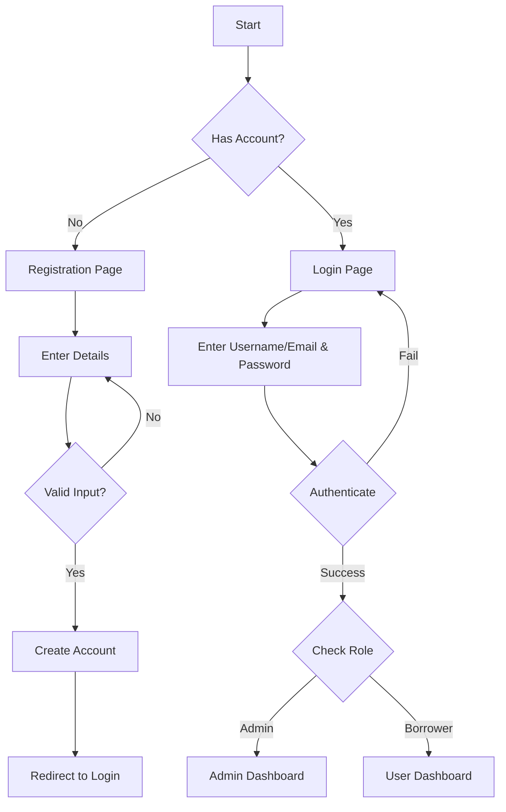
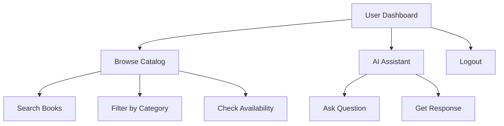
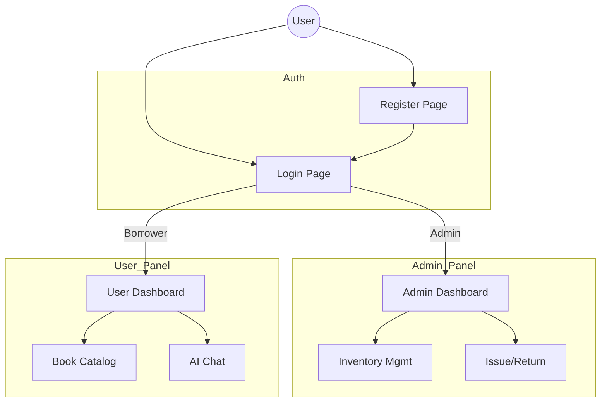

# LMS System Flowcharts

## 1. Authentication Flow
This module handles user access and security.



## 2. Librarian (Admin) Workflow
The Admin manages the system, inventory, and transactions.

```mermaid
graph TD
    A[Admin Dashboard] --> B[Manage Inventory]
    B --> B1[Add New Books]
    B --> B2[Update Stock]
    
    A --> C[Manage Borrowers]
    C --> C1[View List]
    C --> C2[Remove Borrower]
    
    A --> D[Transactions]
    D --> D1[Issue Book (Borrow)]
    D --> D2[Return Book]
    
    D1 --> E[Update System Records]
    D2 --> E
```

## 3. Borrower (User) Workflow
Borrowers use the system to browse resources and get information.



## 4. Complete System Overview


